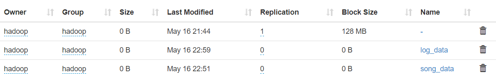
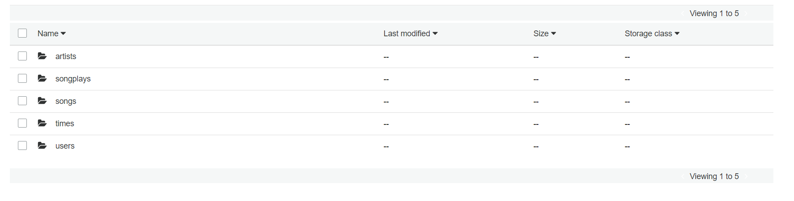
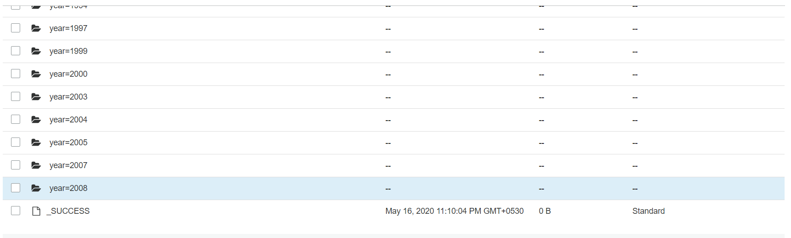

# Project: Data Lake

Building an ETL pipeline that extracts their data from S3, processes them using Spark, and loads the data back into S3 as a set of dimensional tables. This will allow their analytics team to continue finding insights in what songs their users are listening to.
Data loaded from S3, process the data into analytics tables using Spark, and load them back into S3.

### Tools used 
- python
- spark
- hadoop
- AWS EMR
- AWS S3 bucket

# Instruction 

### Schema for Song Play Analysis
#### Fact Table
 - songplays - records in event data associated     with song plays i.e. records with page NextSong
  songplay_id, start_time, user_id, level, song_id, artist_id, session_id, location, user_agent

#### Dimension Tables
 - users - users in the app user_id, first_name,    last_name, gender, level
 - songs - songs in music database song_id, title, artist_id, year, duration
 - artists - artists in music database artist_id, name, location, lattitude, longitude
 - time - timestamps of records in songplays broken down into specific units start_time, hour, day, week, month, year, weekday

# Files

 - etl.py is where data reads from S3, processes that data using Spark, and writes them back to S3

 - project.ipynb file  where the original data was read from the s3 bucket "s3a://udacity-dend/" some of the data was written on the another bucket and deleted after for the studying the original data and how much time it was taking
 
 - .cfg is where all the key configuration info which can be access

 - testing.ipynb is the file where the elt.py file is tested with the local data upload to hdfs and read then the write the data to s3 
    (local data is used too avoid the much time the I/O was taking while paquet the files)

    - local data upload to hdfs
      
    
    - s3 bucket sparkify me
      

    - songs table parquet example
      

 # Ackowledgement 
  - Udacity
  - AWS